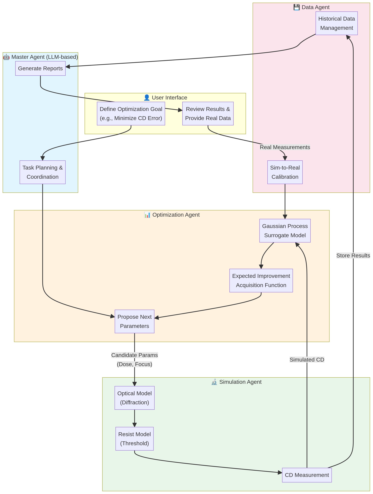
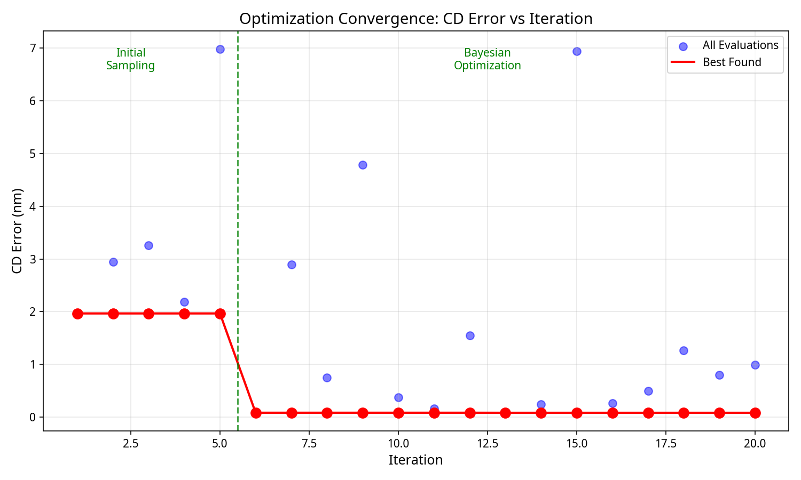
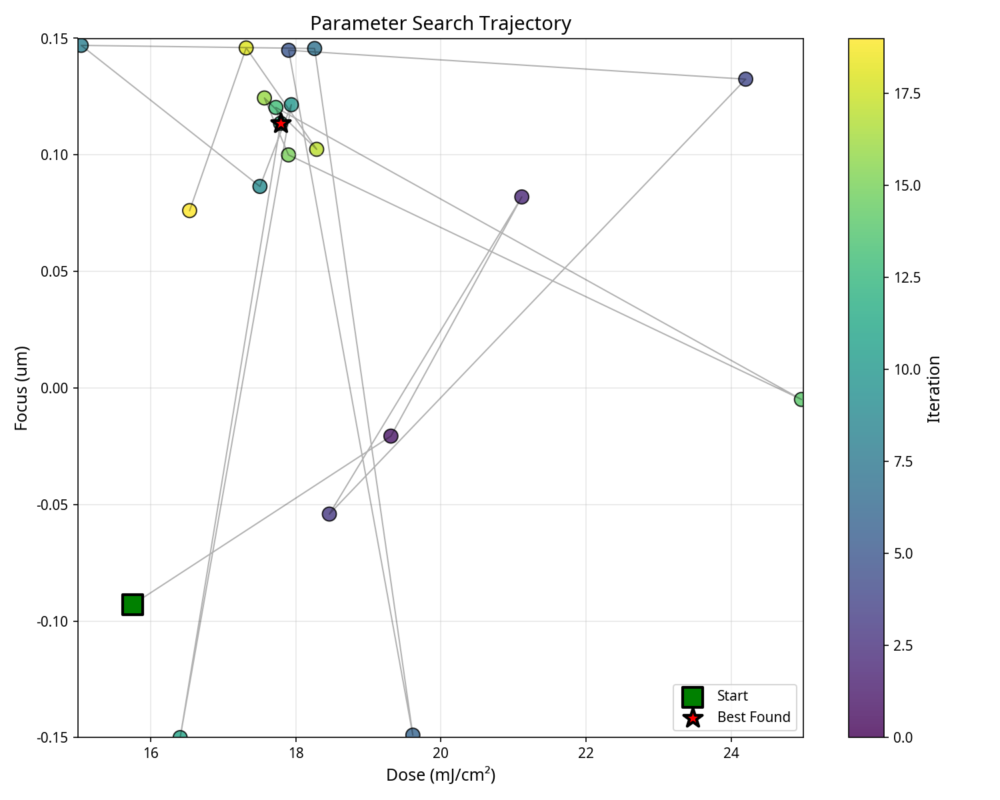
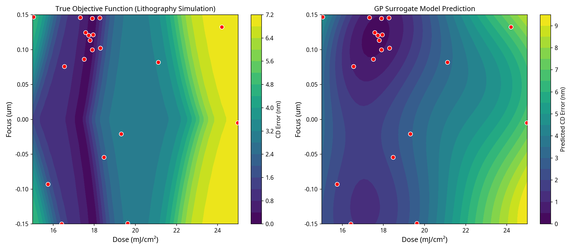

# AI-Driven Closed-Loop Lithography Process Parameter Optimization System - Demo
[![zread](https://img.shields.io/badge/Ask_Zread-_.svg?style=flat&color=00b0aa&labelColor=000000&logo=data%3Aimage%2Fsvg%2Bxml%3Bbase64%2CPHN2ZyB3aWR0aD0iMTYiIGhlaWdodD0iMTYiIHZpZXdCb3g9IjAgMCAxNiAxNiIgZmlsbD0ibm9uZSIgeG1sbnM9Imh0dHA6Ly93d3cudzMub3JnLzIwMDAvc3ZnIj4KPHBhdGggZD0iTTQuOTYxNTYgMS42MDAxSDIuMjQxNTZDMS44ODgxIDEuNjAwMSAxLjYwMTU2IDEuODg2NjQgMS42MDE1NiAyLjI0MDFWNC45NjAxQzEuNjAxNTYgNS4zMTM1NiAxLjg4ODEgNS42MDAxIDIuMjQxNTYgNS42MDAxSDQuOTYxNTZDNS4zMTUwMiA1LjYwMDEgNS42MDE1NiA1LjMxMzU2IDUuNjAxNTYgNC45NjAxVjIuMjQwMUM1LjYwMTU2IDEuODg2NjQgNS4zMTUwMiAxLjYwMDEgNC45NjE1NiAxLjYwMDFaIiBmaWxsPSIjZmZmIi8%2BCjxwYXRoIGQ9Ik00Ljk2MTU2IDEwLjM5OTlIMi4yNDE1NkMxLjg4ODEgMTAuMzk5OSAxLjYwMTU2IDEwLjY4NjQgMS42MDE1NiAxMS4wMzk5VjEzLjc1OTlDMS42MDE1NiAxNC4xMTM0IDEuODg4MSAxNC4zOTk5IDIuMjQxNTYgMTQuMzk5OUg0Ljk2MTU2QzUuMzE1MDIgMTQuMzk5OSA1LjYwMTU2IDE0LjExMzQgNS42MDE1NiAxMy43NTk5VjExLjAzOTlDNS42MDE1NiAxMC42ODY0IDUuMzE1MDIgMTAuMzk5OSA0Ljk2MTU2IDEwLjM5OTlaIiBmaWxsPSIjZmZmIi8%2BCjxwYXRoIGQ9Ik0xMy43NTg0IDEuNjAwMUgxMS4wMzg0QzEwLjY4NSAxLjYwMDEgMTAuMzk4NCAxLjg4NjY0IDEwLjM5ODQgMi4yNDAxVjQuOTYwMUMxMC4zOTg0IDUuMzEzNTYgMTAuNjg1IDUuNjAwMSAxMS4wMzg0IDUuNjAwMUgxMy43NTg0QzE0LjExMTkgNS42MDAxIDE0LjM5ODQgNS4zMTM1NiAxNC4zOTg0IDQuOTYwMVYyLjI0MDFDMTQuMzk4NCAxLjg4NjY0IDE0LjExMTkgMS42MDAxIDEzLjc1ODQgMS42MDAxWiIgZmlsbD0iI2ZmZiIvPgo8cGF0aCBkPSJNNCAxMkwxMiA0TDQgMTJaIiBmaWxsPSIjZmZmIi8%2BCjxwYXRoIGQ9Ik00IDEyTDEyIDQiIHN0cm9rZT0iI2ZmZiIgc3Ryb2tlLXdpZHRoPSIxLjUiIHN0cm9rZS1saW5lY2FwPSJyb3VuZCIvPgo8L3N2Zz4K&logoColor=ffffff)](https://zread.ai/Yixun-Hu/ai_litho_demo)

## 1. Core Concept

This project demonstrates an AI-driven closed-loop system for automatic optimization of lithography process parameters. The core idea is to replace traditional manual parameter tuning that relies on engineer experience, using "virtual experiments + intelligent decision-making" to efficiently and systematically find optimal process recipes.

**Closed-Loop Process**:
1.  **Define Objective**: User sets the optimization goal (e.g., minimize Critical Dimension (CD) error).
2.  **Intelligent Proposal**: The AI optimization agent (based on Bayesian Optimization) proposes a set of candidate process parameters most likely to improve results based on existing data.
3.  **Virtual Experiment**: The differentiable lithography simulator receives these parameters, simulates the lithography process, and predicts the corresponding CD result.
4.  **Evaluation and Update**: Compare simulation results with the target, calculate the deviation. The AI agent updates its internal surrogate model with the new "(parameters, result)" data point.
5.  **Iterative Loop**: Repeat steps 2-4 until convergence criteria are met (e.g., CD error is small enough or preset experiment count is reached).

**Core Value**:
*   **Efficiency**: Intelligent search in high-dimensional parameter space, avoiding blind trial-and-error, significantly reducing experiment count.
*   **Data-Driven**: All decisions are based on simulation data, process is traceable, results are reproducible.
*   **Automation**: Achieve closed-loop operation from parameter search to evaluation, freeing up human resources.

## 2. Technical Architecture and Innovations

This Demo focuses on demonstrating the core technical path of the above closed-loop. Its architecture consists of two key modules:



### Module 1: Differentiable Lithography Simulator (`src/litho_sim.py`)

This is the "virtual experiment platform" of the closed-loop system. Rather than building complex physical models from scratch, we drew inspiration from **TorchLitho** [1] and **LithoBench** [2] to implement a simplified but functionally complete differentiable simulator.

*   **Technical Implementation**: Built with PyTorch. It simulates a simplified optical model (e.g., Gaussian blur to simulate diffraction) and photoresist model (Sigmoid function to simulate development threshold).
*   **Innovation (Differentiability)**: The entire simulation process is fully differentiable. This means we can compute **gradients of output CD with respect to input parameters (such as exposure Dose, Focus)**. Although this Demo primarily uses Bayesian Optimization (a black-box optimization method), differentiability enables more efficient gradient-based optimization algorithms (like Adam) in the future.

### Module 2: Bayesian Optimization Agent (`src/bo_agent.py`)

This is the "intelligent decision-making brain" of the closed-loop system. It is responsible for making the wisest parameter choices under uncertainty.

*   **Technical Implementation**: Implemented based on the **BoTorch** [3] library. It maintains an internal Gaussian Process (GP) surrogate model to fit the unknown black-box function "process parameters -> CD error".
*   **Decision Logic**: Uses **Expected Improvement (EI)** as the acquisition function. EI effectively balances "exploitation (exploring near currently known optimal solutions)" and "exploration (exploring regions with high uncertainty)", thus avoiding local optima.

## 3. How to Run the Demo

### 3.1. Environment Setup

```bash
# Recommended to use conda to create an isolated environment
conda create -n litho_demo python=3.8
conda activate litho_demo

# Install core dependencies
pip install torch botorch gpytorch numpy matplotlib
```

### 3.2. Run Closed-Loop Optimization

```bash
python src/main.py
```

The script will perform the following operations:
1.  Initialize the lithography simulator and a "real" target CD value.
2.  Initialize the Bayesian optimization agent, defining search ranges for parameters (Dose, Focus).
3.  Run 15 iterations of closed-loop optimization.
4.  In each iteration, print the AI-proposed parameters, simulated CD, and current best result.
5.  After optimization, generate two plots in the `results/` directory:
    *   `convergence_plot.png`: Shows the convergence process of CD error across iterations.
    *   `parameter_search.png`: Shows the AI's exploration path in 2D parameter space.

## 4. Demo Results

### Optimization Convergence Curve

The figure below shows how CD error changes with iteration count. After the initial sampling phase (first 5 iterations) establishes the surrogate model, the Bayesian optimization phase rapidly converges to the optimal solution.



**Key Findings**: 
- Initial best CD error: ~1.97 nm
- Final CD error: **0.08 nm** (after only 6 BO iterations)
- Total experiment count: 20

### Parameter Search Trajectory

The figure below shows the AI's exploration path in 2D parameter space (Dose × Focus). Color from dark to light indicates iteration order.



### GP Surrogate Model Visualization

The figure below compares the true objective function (left) and GP surrogate model prediction (right). Red dots are sampling points.



## 5. Project Structure

```
ai_litho_demo/
├── README.md                    # Project documentation
├── src/
│   ├── litho_sim.py            # Differentiable lithography simulator
│   ├── bo_agent.py             # Bayesian optimization agent
│   └── main.py                 # Closed-loop optimization main program
├── data/
│   └── (reserved for real datasets)
├── results/
│   ├── optimization_history.json   # Optimization history data
│   ├── convergence_plot.png        # Convergence curve plot
│   ├── parameter_search.png        # Search trajectory plot
│   └── surrogate_model.png         # Surrogate model plot
└── docs/
    └── architecture.png            # System architecture diagram
```

## 6. Convert Markdown to PDF

```bash
python md2pdf.py --help
python md2pdf.py "AI-Driven_Litho_Demo.md" "AI-Driven_Litho_Demo.pdf"
```

## 7. References

[1] Chen, G., et al. (2024). Open-Source Differentiable Lithography Imaging Framework. *SPIE Advanced Lithography + Patterning*.

[2] Zheng, S., et al. (2023). LithoBench: Benchmarking AI Computational Lithography. *NeurIPS*.

[3] Balandat, M., et al. (2020). BoTorch: A Framework for Efficient Monte-Carlo Bayesian Optimization. *NeurIPS*.
